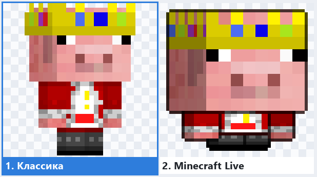
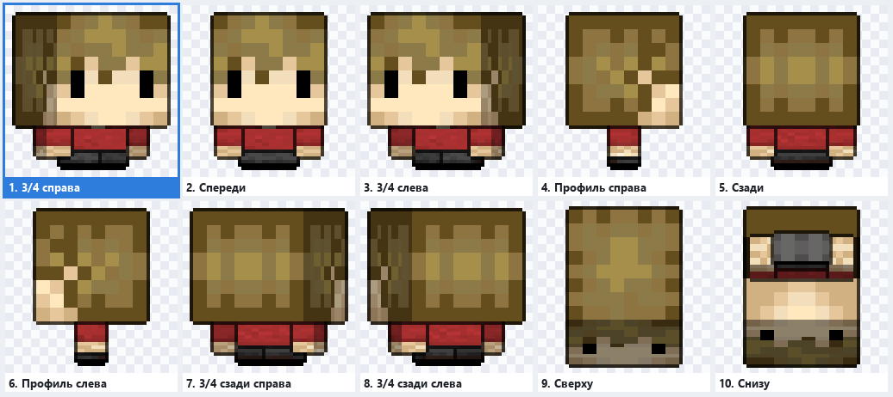
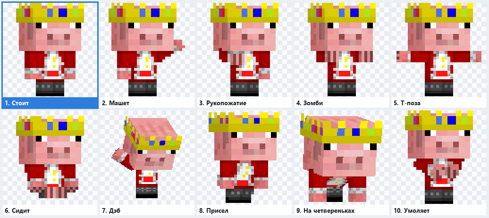

# 🧸 Chibi Emoji Bot

🎨 **Chibi Emoji Bot** is a Telegram bot that turns Minecraft skins into chibi **custom emoji packs** and
**sticker packs** — static or animated. Think [Minecraft Chibi Skin Maker](https://nogard.dev/tools/minecraft-chibi-skin-maker),
but right inside a chat: its own renderer, settings with preview images, and packs that build and publish
themselves in Telegram.

> The bot's interface is in Russian; button names below are quoted as they appear, with a translation.

<p align="center">
  
  
</p>

## 📋 Features

- 📥 **Skins from anywhere**: Minecraft Java nicknames (separated by commas, `;` or new lines), UUIDs,
  PNG files (64×64, legacy 64×32, HD 128×128 and up), ZIP/TAR archives (PNGs plus a `.txt` list of nicknames).
  Skins can be sent at any time — the bot asks which pack to add them to.
- 🎨 **Two styles**: Classic (pixel-art chibi) and Minecraft Live (huge head, every part outlined).
- 🧍 **Body type**: Auto / Steve / Alex (Auto uses Mojang's profile data or the skin's pixels).
- 🤸 **10 poses**, 🖼 **4 framings** (full body, half body, portrait, head), 🎬 **25 animations**,
  📷 **10 camera angles**, 👁 **12 part toggles** (base and second layer separately),
  render mode (pixel art / smooth), outline, animation speed, and the emoji the item is linked to.
- 🖼 Every step shows a preview sheet drawn with **your own** skin (an animated grid for animations).
- ⚡ After picking the style and body type you can hit «✅ Создать» (Create) right away or keep tuning.
- 🗂 **Pack management**: overview sheet, item list, redraw an item with new settings (in place),
  "make first" (pack icon), delete, rename, change history.
- 🔁 **Conversion** of an emoji pack into a sticker pack and back.
- 👑 **Roles**: players manage only their own packs within limits; admins have no limits and see every pack,
  who created and changed it and when, a global audit log, users and their usage.

<p align="center"></p>

## 😀 Emoji packs and 🖼 sticker packs

| | 😀 Emoji pack | 🖼 Sticker pack |
|---|---|---|
| What it is | custom emoji inside message text | regular stickers |
| Image size | 100×100 | 512×512 |
| Max items per pack | 200 | 120 |
| Link | `t.me/addemoji/…` | `t.me/addstickers/…` |
| Telegram Premium required | yes, to send them | no |

The kind is chosen when a pack is created; everything else is shared. Static items are PNG,
animated ones are WEBM (VP9 with transparency, up to 3 seconds); both can be mixed in one pack.

**Conversion.** The «🔁 Сделать стикер-пак из этого» button ("Make a sticker pack from this" — or "emoji pack"
for the reverse) creates a new pack of the other kind and redraws every item at the right size, each with its
own skin and settings, in the same order. The source pack stays as it is: Telegram cannot change the kind of
an existing set.

## 🚦 Player limits

| Limit | Default | How it counts |
|---|---|---|
| Non-empty packs | 5 | emoji and sticker packs together; a pack starts counting with its first item |
| Empty packs at once | 3 | guards against endless drafts |
| Emoji and stickers per 24 hours | 150 | rolling window; creating, redrawing and converting count, deleting gives nothing back |
| Skins per batch | 50 | size of one queue |

The remaining quota is shown in the menu ("120 of 150 left"); once it runs out, the bot says when the next
slot frees up. The quota is charged to whoever draws: when an admin adds items to a player's pack, the player's
quota does not change. Admins set personal limits with `/setlimit`.

## 🚀 Quick start

Requires Python 3.10+ and a bot token from [@BotFather](https://t.me/BotFather).

```bash
git clone https://github.com/BbIJABNPOBATEJb/Chibi-Emoji-Bot.git
```

```bash
cd Chibi-Emoji-Bot && pip install -r requirements.txt
```

Copy `.env.example` to `.env`, fill in `BOT_TOKEN` and run:

```bash
python bot.py
```

On Windows you can simply run `run.bat`.

**ffmpeg** is needed for animations. The bot looks for it in `FFMPEG_PATH`, then in `PATH`, then falls back to
the `imageio-ffmpeg` package installed from `requirements.txt` — usually nothing else has to be installed.

## 👑 Admins

Get your ID with `/id`, put it into `ADMIN_IDS` in `.env` and restart the bot.
Alternatively, while there are no admins at all, the bot prints a one-time `/claim <code>` command
to its log on startup — send it to the bot.

| Command | What it does |
|---|---|
| `/addadmin ID`, `/deladmin ID` | grant / revoke admin rights |
| `/admins` | list admins |
| `/setlimit ID` | a player's limits and usage |
| `/setlimit ID packs items_per_day` | personal limits (`0` — unlimited, `-` — as in `.env`) |
| `/stats` | statistics |

## ⚙️ Settings (`.env`)

| Variable | Default | Meaning |
|---|---|---|
| `BOT_TOKEN` | — | token from @BotFather |
| `ADMIN_IDS` | empty | admin IDs, comma-separated |
| `MAX_PACKS_PER_USER` | 5 | non-empty packs per player, emoji and stickers together (0 — unlimited) |
| `DAILY_EMOJI_LIMIT` | 150 | emoji and stickers per player per 24 hours (0 — unlimited) |
| `MAX_EMPTY_PACKS` | 3 | empty packs at once |
| `MAX_BATCH_USER` / `MAX_BATCH_ADMIN` | 50 / 200 | skins per batch |
| `TIMEZONE` | Europe/Moscow | time zone for the audit log and logs |
| `DATA_DIR` | data | SQLite database, skins, thumbnails |
| `RENDER_WORKERS` | auto | render processes: a number or `auto` (one per core, at most 4) |
| `FFMPEG_PATH` | empty | path to ffmpeg if it is not in `PATH` |
| `TITLE_SUFFIX` | auto | appended to every pack title: `auto` — `@bot_username`, `none` — nothing, or any text |
| `DOCKER_MTU` | 1400 | container network MTU (Docker only, see below) |

## 🐳 Running on a server with Docker

The image has everything it needs: Python 3.12, ffmpeg (VP9 and H.264) and a font with Cyrillic.
The bot runs as a non-root user; the database, skins and thumbnails live in `./data` next to `docker-compose.yml`.

```bash
git clone https://github.com/BbIJABNPOBATEJb/Chibi-Emoji-Bot.git /opt/chibi-bot
```

```bash
cd /opt/chibi-bot && cp .env.example .env && nano .env
```

```bash
docker compose up -d --build
```

Logs (including the `/claim` code when `ADMIN_IDS` is empty):

```bash
docker compose logs -f
```

Update: `git pull && docker compose up -d --build`. Stop: `docker compose down` — data in `./data` is kept.

- **Moving existing packs.** Stop the old bot and copy the whole `data/` folder (`bot.sqlite3` together with its
  `-wal`/`-shm` files, `skins/`, `thumbs/`) into `./data` before the first start. The container fixes the
  folder's permissions itself.
- **One token — one instance.** Two bots with the same token get in each other's way (`Conflict` in the logs).
- **Resources.** `RENDER_WORKERS=auto` adapts to the number of cores, memory is capped with `mem_limit: 1g`.
  To limit CPU further, add `cpus: 1.5` to `docker-compose.yml` — the value may not exceed the server's core
  count, otherwise Docker refuses to start the container.
- **MTU.** The bot's network is created with MTU 1400. Many VPS/VPN hosts have an interface MTU below Docker's
  default 1500 (e.g. 1448): large TLS packets then get lost and HTTPS requests from the container (Mojang,
  file downloads) hang at random. If your MTU is even lower (`ip link` → `mtu`), set `DOCKER_MTU` 50 below it
  and run `docker compose down && docker compose up -d`.
- **Backups** are just an archive of `data/`, best taken with the bot stopped:
  `docker compose stop && tar czf chibi-backup.tgz data && docker compose start`.

## 🖥 Running on a server without Docker

You need Python 3.10+, `ffmpeg` with `libvpx` (or `imageio-ffmpeg`) and a font with Cyrillic for the
labels on preview sheets (`fonts-dejavu-core`). Example systemd unit:

```ini
[Unit]
Description=Chibi Emoji Bot
After=network-online.target

[Service]
WorkingDirectory=/opt/chibi-bot
ExecStart=/opt/chibi-bot/.venv/bin/python bot.py
Restart=always

[Install]
WantedBy=multi-user.target
```

## 🧱 Project layout

```
bot.py                  entry point (kept tiny: render processes re-import this file)
chibibot/
  main.py               startup: services, aiogram 3 dispatcher, long polling
  config.py             settings from .env
  kinds.py              emoji pack vs sticker pack: sizes, limits, links
  render/               the renderer — a custom numpy rasteriser
    skin.py             skin loading: HD, legacy 64×32, Alex detection
    model.py            Classic and Minecraft Live models (boxes, UVs, proportions)
    pose.py             10 poses and 25 animations
    engine.py           cameras, z-buffer, shading, outlines, scale fitting for 100 and 512 px
    encode.py           PNG, VP9 WEBM with alpha, MP4 previews (frames are streamed into ffmpeg)
    previews.py         labelled preview sheets
    options.py          every option and its key
  sources.py            nicknames → skins (Mojang API + fallback mirror), PNGs, archives
  stickers.py           Telegram sets: create, add, replace, reorder, sync
  db.py                 SQLite: users, packs, items, audit log, quotas
  jobs.py               render process pool that survives a crashed process
  tg/                   handlers: menu, packs, wizard, conversion, admin, quick add
tests/                  smoke test and server checks
docs/                   images for this README
```

The renderer is not a copy of the website but an independent implementation: the figure is assembled from
textured boxes and drawn with an oblique projection, so the facing side always stays clean pixel art
(2 px per head texel in Classic, 3 px in Live), while poses, camera angles and animations work in any combination.

## 🧪 Tests

```bash
python tests/smoke_test.py
```

Walks through the whole player and admin journey on a fake Telegram API — creating packs of both kinds,
the wizard, uploads, redraws, conversion, limits, admin tools — and checks image sizes against Telegram's rules.
It needs internet access for Mojang lookups; nothing is sent to the real Telegram.

Checks that are handy on a server:

- `tests/worker_test.py` — the render pool survives a killed process (e.g. out of memory);
- `tests/memory_check.py` — peak memory of the heaviest jobs (Linux only);
- `tests/fetch_timing.py` — how long nickname lookups take from this machine.

With Docker, run them in a throwaway container next to the bot:

```bash
docker run --rm --network chibi-bot_default -v "$PWD/tests:/app/tests:ro" chibi-emoji-bot python tests/worker_test.py
```

## ℹ️ Good to know

- A pack appears in Telegram with its first item; until then it is "empty" and does not count towards the limit.
- Custom emoji can be sent by **Telegram Premium** users; stickers work for everyone.
- An emoji pack holds up to **200** items, a sticker pack up to **120** (Telegram limits).
- A pack belongs to the user who created it, and that user must have started the bot at least once.
  Admins add items to other people's packs on the owner's behalf.
- Every pack title in Telegram gets `@bot_username` appended (`TITLE_SUFFIX`).
- The wizard state lives in memory: after a bot restart an unfinished setup has to be started again.
